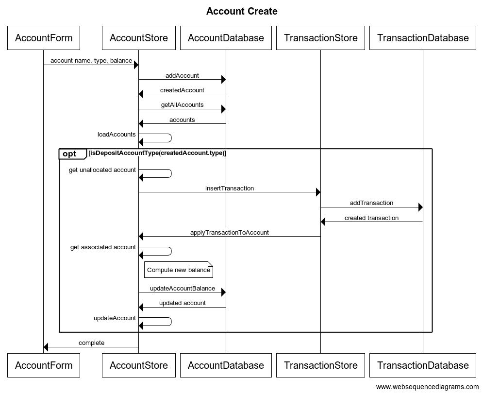
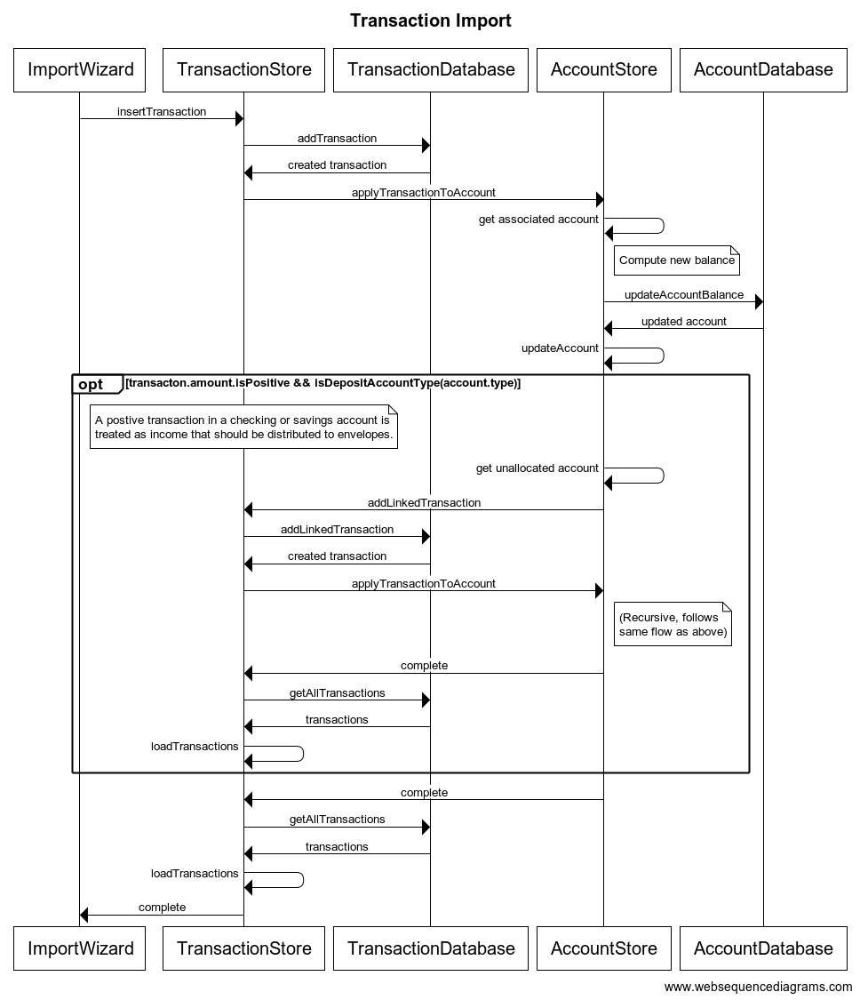

# Envelope

Budget your money using the envelope method.

https://en.wikipedia.org/wiki/Envelope_system

## Data Flows





## Run/Build

_Note:_ This project is based on [**electron-react-typescript-webpack-boilerplate**](https://github.com/Devtography/electron-react-typescript-webpack-boilerplate), so much of the 
usage/build instructions were copied from [that project's README](https://github.com/Devtography/electron-react-typescript-webpack-boilerplate/blob/master/README.md).

### Running in dev mode

Execute the following command to start Webpack in development mode and 
watch the changes on source files for live rebuild on code changes.
```sh
npm run dev
```

To start the app, execute the following command in a separate terminal:
```sh
npm start
```

### Building the installer
The boilerplate is currently configured to package & build the installer of 
your app for macOS & Windows using `electron-builder`. 

For macOS, execute:
```sh
npm run build:mac
```

For Windows, execute:
```sh
npm run build:win
```
_** `asar` archiving is disabled by default in Windows build as it can cause 
errors while running the installed Electron app based on pervious experiences, 
whereas the macOS build with `asar` enabled works just fine. You can turn it 
back on by removing line 23 (`"asar": false`) in `package.json`. **_

#### Extra options
The build scripts are pre-configured to build 64 bit installers since 64 bit 
should be the standard for a modern applications. 32 bit builds are still 
possible by changing the build scripts in `package.json` as below:
```javascript
// from
"scripts": {
    // ...
    "build:win": "electron-builder build --win --x64",
    "build:mac": "electron-builder build --mac --x64"
},

// to
"scripts": {
    // ...
    "build:win": "electron-builder build --win --ia32",
    // Works only on macOS version < 10.15
    "build:mac": "electron-builder build --mac --ia32"
},
```

Builds for Linux, armv71, and arm64 can also be configured by modifying the 
build scripts in `package.json`, but those aren't tested yet. For details, 
please refer to [documents of `electron-builder`](https://www.electron.build/cli).
